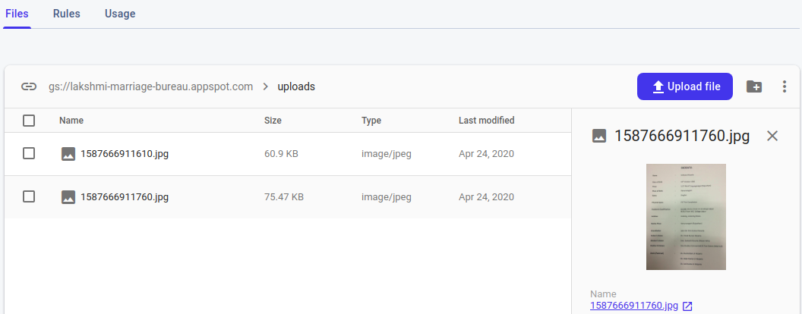

# Marriage-Bureau-app
A simple app built for my father's marriage bureau to maintain the biodatas and easy the search process.

# Features:

1. Used Google Firebase to store all the information.
2. An email is sent to the gmail account whenever a new profile is added or deleted.
3. Can search on the basis of requirements like age, location etc.
4. Can be used as a place to collect all the bio-datas which can be easily accessed.


# Installation

Since, the app stores all the data on Google Firebase RealTime database and storing all the files/photos/Biodata in Firebase storage, you need to create an account on Google Firebase: Refer this [link](https://www.geeksforgeeks.org/adding-firebase-to-android-app/) for more details. Don't forget to add google-services.json file.


Also, Add the gmail id and password in the Config.java file where an email will be sent while adding/deleting profile. NOTE: Using google email as admin, you need to enable permission for security lesser-secure apps from the settings of the admin Gmail. Else Gmail will block the access and you will get authorization exception.
Here is the shortcut to enable that setting. (Make sure your login with admin email) https://www.google.com/settings/security/lesssecureapps

If javax dependency is not installed, follow the steps given in this [link](https://abhiandroid.com/androidstudio/import-add-external-jar-files-android-studio.html)

# What's going behind?

Adding a short snippets of codes to show how this is working?

## Adding a new profile:


In the database, data is stored in json format. So we will be using person objects.
For every profile added, a person object is created which is added to Firebase Realtime database and the images/bio-data related to that profile is added to the Firebase Storage. The url of this images/bio-data is also stored in the person object as shown: 

Also objects stored in Storage are as follows 


### Code

```
   	// Getting reference to the Person Object
	mDatabase = FirebaseDatabase.getInstance().getReference().child("Person");
        storageReference = FirebaseStorage.getInstance().getReference();
	
        // To add a new profile,a key is created to that profile object and update accordingly.
        String key =  MainActivity.mDatabase.push().getKey();
        Person person = getPersonObject(); // return the person object
        sendEmail(Config.EMAIL, "Add Profile: " + person.getName() + " " + person.getGender(), "ID: " + key );
        
        // For adding the images and other files, they are uploaded to the storage and then their url is added to person object
        
        import com.google.firebase.storage.StorageReference;
	import com.google.firebase.storage.UploadTask;
        StorageReference sRef = MainActivity.storageReference.child("uploads/" + System.currentTimeMillis() + "." + getFileExtension(filePath)); // filePath stores URI to the file and used time's milliseconds so no two files are with same name.
	UploadTask uploadTask = sRef.putFile(filePath1);

	Task<Uri> urlTask = uploadTask.continueWithTask(new Continuation<UploadTask.TaskSnapshot, Task<Uri>>() {
		@Override
		public Task<Uri> then(@NonNull Task<UploadTask.TaskSnapshot> task) throws Exception {
		    if (!task.isSuccessful()) {
		        Toast.makeText(addNewData.this, "Uploading failed! Please try again", Toast.LENGTH_LONG).show();
		        throw task.getException();
		    }
		    // Continue with the task to get the download URL
		    return sRef.getDownloadUrl();
		}
	    }).addOnCompleteListener(new OnCompleteListener<Uri>() {
		@Override
		public void onComplete(@NonNull Task<Uri> task) {
		    if (task.isSuccessful()) {
		        Uri downloadUri = task.getResult();
		        person.setPhoto1url(downloadUri.toString());
		        mDatabase.child(key).child("photo1url").setValue(downloadUri.toString());
		        
		    }
		}
	    });

```


## View all the profiles and delete the profiles:

Used [Recycler view](https://developer.android.com/guide/topics/ui/layout/recyclerview) to show all the profiles in a scrollable card format. Used custom cards view to show each profile in the recycler view using an adapter. Clicking on delete icon will pop up the alert dialog for confirmation. On confirmation, that object are deleted from the firebase storage and database.

#### Step1: Create Card View layout in a new xml file named card_view_layout.xml

```
	<?xml version="1.0" encoding="utf-8"?>
	<androidx.cardview.widget.CardView xmlns:android="http://schemas.android.com/apk/res/android"
	xmlns:app="http://schemas.android.com/apk/res-auto"
	android:layout_width="match_parent">

	    <LinearLayout
		// Put your customized layout for a single card(profile) here.
	    </LinearLayout>

	</androidx.cardview.widget.CardView>

```

#### Step2: Create Recycle View layout in a new xml file 

```
	<?xml version="1.0" encoding="utf-8"?>
	<androidx.constraintlayout.widget.ConstraintLayout xmlns:android="http://schemas.android.com/apk/res/android"
	    xmlns:app="http://schemas.android.com/apk/res-auto"
	    xmlns:tools="http://schemas.android.com/tools"
	    android:layout_width="match_parent"
	    android:layout_height="match_parent"
	    tools:context=".showBiodata"> // defining which Activity or Fragment class has instantiated the layout which is being defined.

	    <androidx.recyclerview.widget.RecyclerView
		android:id="@+id/list"
		android:layout_width="match_parent"
		android:layout_height="match_parent">
	    </androidx.recyclerview.widget.RecyclerView>

	</androidx.constraintlayout.widget.ConstraintLayout>
```


#### Step 3: Creating the adapter class MyAdapter.Java

```
	public class MyAdapter extends RecyclerView.Adapter<MyAdapter.ViewHolder> {

	    private Context context;
	    private List<Person> persons;
	    private OnCardListener mOnCardListener;

	    public MyAdapter(Context context, List<Person> persons, showBiodata mOnCardListener) {
		this.persons = persons;
		this.context = context;
		this.mOnCardListener = mOnCardListener;
	    }

	    @Override
	    public ViewHolder onCreateViewHolder(ViewGroup parent, int viewType) {
		View v = LayoutInflater.from(parent.getContext())
		        .inflate(R.layout.card_view_layout, parent, false);
		ViewHolder viewHolder = new ViewHolder(v, mOnCardListener);
		return viewHolder;
	    }

	    @Override
	    public void onBindViewHolder(ViewHolder holder, int position) {
		Person person = persons.get(position);
		// set person variable in the holder like holder.listGender.setText("Male");
	    }

	    @Override
	    public int getItemCount() {
		return persons.size();
	    }

	    class ViewHolder extends RecyclerView.ViewHolder implements View.OnClickListener {

		TextView listGender;
		ImageView listDelete;
		OnCardListener onCardListener; // clicking this image will start the profile deletion process

		public ViewHolder(View itemView, OnCardListener onCardListener) {
		    super(itemView);

		    // map the views to their ids
		    listGender = (TextView) itemView.findViewById(R.id.listGender);
		    this.onCardListener = onCardListener;
		    itemView.setOnClickListener(this);
		    listDelete.setOnClickListener(this);
		}

		@Override
		public void onClick(View v) {
		    if (v == listDelete){
		        onCardListener.onDeleteClick(getAdapterPosition());
		    }
		    else
		        onCardListener.onCardClick(getAdapterPosition());
		}
	    }

	    public interface OnCardListener {
	    	// Methods on clicking card
		void onCardClick(int position); // show expanded view
		void onDeleteClick(int position); // delete the profile
	    }
	}

```

#### Step4: Create main file showBiodata.java

```

	public class showBiodata extends AppCompatActivity implements MyAdapter.OnCardListener {
	    
	    private RecyclerView recyclerView;
	    private RecyclerView.Adapter adapter;
	    private ProgressDialog progressDialog;
	    private List<String> keys; // store key of the objects in database
	    static List<Person> persons; // store person onjects from database

	    @Override
	    protected void onCreate(Bundle savedInstanceState) {
		super.onCreate(savedInstanceState);
		setContentView(R.layout.activity_show_biodata);
		setTitle("Profiles");

		recyclerView = findViewById(R.id.list);
		recyclerView.setHasFixedSize(true);
		recyclerView.setLayoutManager(new LinearLayoutManager(this));

		persons = new ArrayList<>();
		keys = new ArrayList<>();

		MainActivity.mDatabase.addValueEventListener(new ValueEventListener() {
		    @Override
		    public void onDataChange(@NonNull DataSnapshot dataSnapshot) {
		        persons.clear();
		        //iterating through all the values in database
		        for (DataSnapshot postSnapshot : dataSnapshot.getChildren()) {
		                Person person = postSnapshot.getValue(Person.class);
		                keys.add(postSnapshot.getKey());
		                persons.add(person);
		            }

		        }
		        
		        adapter = new MyAdapter(getApplicationContext(), persons, showBiodata.this); //creating adapter 
		        recyclerView.setAdapter(adapter); //adding adapter to recyclerview
		    }
		});
	    }

	    @Override
	    public void onCardClick(int position) {
		// Methods to show the card in expanded way
		Intent intent = new Intent(getApplicationContext(), showCompleteBiodata.class);
		intent.putExtra("position", position);
		startActivity(intent);
		

	    }

	    private void sendEmail(String email, String subject, String message) {
		SendMail sm = new SendMail(this, email, subject, message, null);
		//Executing sendmail to send email
		sm.execute();
	    }

	    @Override
	    public void onDeleteClick(final int position) {
	    
		new AlertDialog.Builder(this)
		        .setIcon(android.R.drawable.ic_dialog_alert)
		        .setTitle("Delete")
		        .setMessage("Are you sure to delete this biodata?")
		        .setPositiveButton("Yes", new DialogInterface.OnClickListener() {
		            @Override
		            public void onClick(DialogInterface dialog, int which) {
		                mDatabase.child(keys.get(position)).removeValue();

		                Person tempPerson = persons.get(position);
		                FirebaseStorage.getInstance().getReferenceFromUrl(tempPerson.getPhoto1url()).delete(); // remove item from Firebase Storage
		                
		                sendEmail(Config.EMAIL, "Delete Profile", "ID: " + keys.get(position) + "\n" + "Name: "+ tempPerson.getName());
		                keys.remove(position);
		                persons.remove(position);
		                recyclerView.removeViewAt(position);

		                adapter.notifyItemRemoved(position);
		                adapter.notifyItemRangeChanged(position, adapter.getItemCount());
		                adapter.notifyDataSetChanged();
		            }

		        })
		        .setNegativeButton("No", null)
		        .show();

	    }
	}

```


## Sending an email using javax

##### Created a class to send email

```
	import android.os.AsyncTask;
	import android.app.ProgressDialog;
	import android.content.Context;

	import android.util.Log;
	import android.widget.Toast;

	import java.io.File;
	import java.io.IOException;
	import java.util.ArrayList;
	import java.util.Properties;

	import javax.activation.CommandMap;
	import javax.activation.DataHandler;
	import javax.activation.DataSource;
	import javax.activation.FileDataSource;
	import javax.activation.MailcapCommandMap;
	import javax.mail.Message;
	import javax.mail.MessagingException;
	import javax.mail.Multipart;
	import javax.mail.PasswordAuthentication;
	import javax.mail.Session;
	import javax.mail.Transport;
	import javax.mail.internet.InternetAddress;
	import javax.mail.internet.MimeBodyPart;
	import javax.mail.internet.MimeMessage;
	import javax.mail.internet.MimeMultipart;

	public class SendMail extends AsyncTask<Void,Void,Void> {

	    //Declaring Variables
	    private Context context;
	    private Session session;

	    //Information to send email
	    private String email;
	    private String subject;
	    private String message;
	    private ArrayList<File> attachFiles; // files to be attached


	    //Class Constructor
	    public SendMail(Context context, String email, String subject, String message, ArrayList<File>  attachFile){
		//Initializing variables
		this.context = context;
		this.email = email;
		this.subject = subject;
		this.message = message;
		this.attachFiles = new ArrayList<>();
		if(attachFile != null && attachFile.size()>0){
		    for(File file: attachFile)
		        this.attachFiles.add(file);
		}

		MailcapCommandMap mc = (MailcapCommandMap) CommandMap.getDefaultCommandMap();
		mc.addMailcap("text/html;; x-java-content-handler=com.sun.mail.handlers.text_html");
		mc.addMailcap("text/xml;; x-java-content-handler=com.sun.mail.handlers.text_xml");
		mc.addMailcap("text/plain;; x-java-content-handler=com.sun.mail.handlers.text_plain");
		mc.addMailcap("multipart/*;; x-java-content-handler=com.sun.mail.handlers.multipart_mixed");
		mc.addMailcap("message/rfc822;; x-java-content-handler=com.sun.mail.handlers.message_rfc822");
		CommandMap.setDefaultCommandMap(mc);
	    }

	    @Override
	    protected void onPreExecute() {
		super.onPreExecute();
	    }

	    @Override
	    protected void onPostExecute(Void aVoid) {
		super.onPostExecute(aVoid);
		Toast.makeText(context,"Message Sent",Toast.LENGTH_LONG).show();
	    }

	    @Override
	    protected Void doInBackground(Void... params) {
		//Creating properties
		Properties props = new Properties();

		//Configuring properties for gmail
		//If you are not using gmail you may need to change the values
		props.put("mail.smtp.host", "smtp.gmail.com");
		props.put("mail.smtp.socketFactory.port", "465");
		props.put("mail.smtp.socketFactory.class", "javax.net.ssl.SSLSocketFactory");
		props.put("mail.smtp.auth", "true");
		props.put("mail.smtp.port", "465");

		//Creating a new session
		session = Session.getDefaultInstance(props,
		        new javax.mail.Authenticator() {
		            //Authenticating the password
		            protected PasswordAuthentication getPasswordAuthentication() {
		                return new PasswordAuthentication(Config.EMAIL, Config.PASSWORD);
		            }
		        });

		try {
		    
		    MimeMessage mm = new MimeMessage(session); //Creating MimeMessage object
		    mm.setFrom(new InternetAddress(Config.EMAIL)); //Setting sender address
		    mm.addRecipient(Message.RecipientType.TO, new InternetAddress(email)); //Adding receiver
		    mm.setSubject(subject); //Adding subject            
		    // mm.setText(message); //Adding message

		    // creates message part
		    MimeBodyPart messageBodyPart = new MimeBodyPart();
		    messageBodyPart.setContent(message, "text/html");

		    // creates multi-part
		    Multipart multipart = new MimeMultipart();
		    multipart.addBodyPart(messageBodyPart);

		    // adds attachments
		    if (this.attachFiles != null && this.attachFiles.size() > 0) {
		        for (File filePath :this.attachFiles) {
		            MimeBodyPart attachPart = new MimeBodyPart();
		            attachPart.attachFile(filePath);
		            multipart.addBodyPart(attachPart);
		        }
		    }

		    // sets the multi-part as e-mail's content
		    mm.setContent(multipart);

		    //Sending email
		    Transport.send(mm);

		} catch (MessagingException e) {
		    e.printStackTrace();
		} catch (IOException e) {
		    e.printStackTrace();
		}
		return null;
	    }
	}

```


